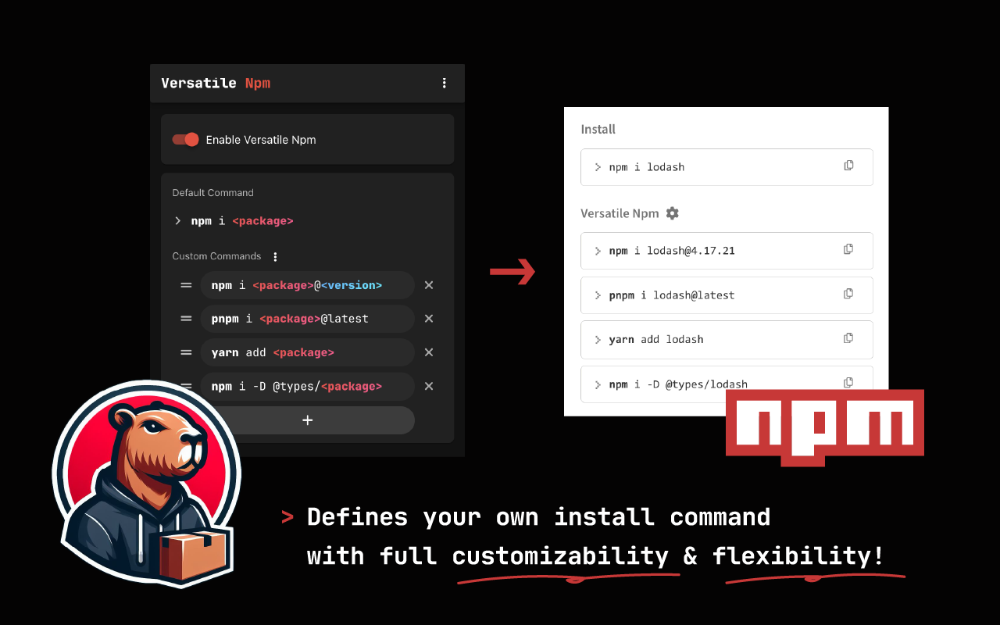
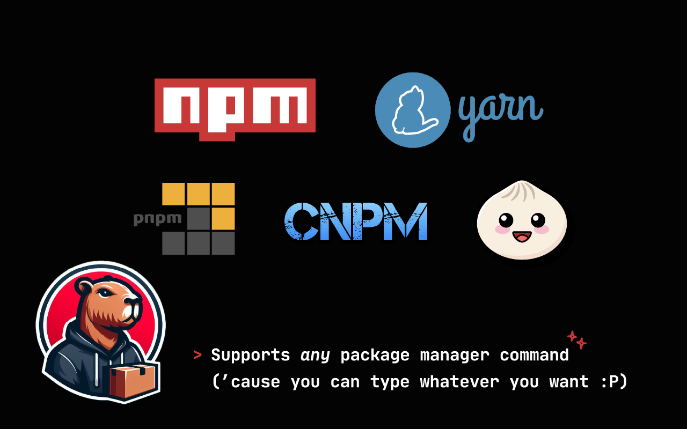

  

  A browser extension that lets you customize install commands on Npm.

  
  
  
  

# Versatile Npm

### Download from Chrome Web Store

## Documentation

http://versatile-npm.ngseke.me/

## Features

## Installation

### Manual Download

Download latest `build.zip` from [releases](https://github.com/ngseke/versatile-npm/releases) and unzip.

  
Installation Steps

  1. Access [chrome://extensions/](chrome://extensions/)
  2. Check `Developer mode`
  3. Click on `Load unpacked extension`
  4. Select the extracted folder  for use

